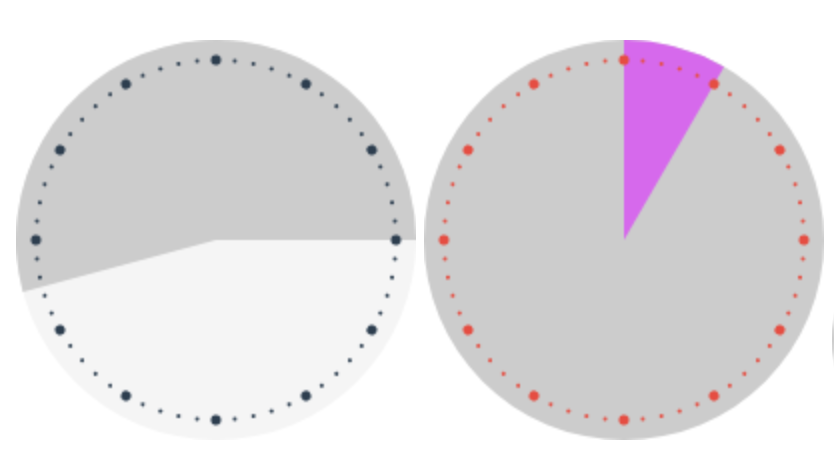

# 🕒 vue-analog-clock-range

Vue Analog Clock Range is a simple clock range component for Vue.

## Install

```
yarn add vue-analog-clock-range
```

## Examples

```html
<VueAnalogClockRange
  :radius="100"
  start="08:30"
  end="15:00"
  background-color='#ccc'
  range-color='#d864ef'>
</VueAnalogClockRange>
```

This will select the analog range of given hours:


### Colored Markers/Decors

```html
<VueAnalogClockRange
  :radius="100"
  :show-decor="true"
  start="08:30"
  end="15:00"
  decor-color='#e74c3c'
  background-color='#ccc'
  range-color='#d864ef'>
</VueAnalogClockRange>
```


## License

MIT.
